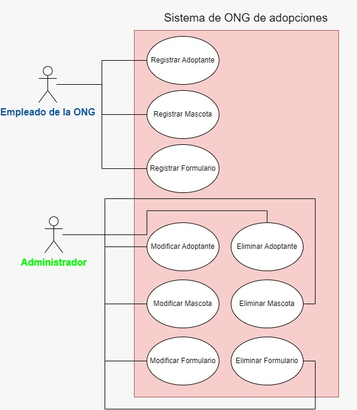
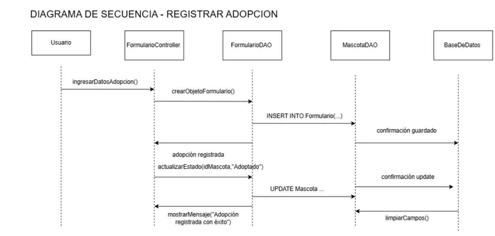

# Trabajo Práctico Integrador - Desarrollo de Sistemas Orientado a Objetos
# 🐾 OngAdopciones

Este proyecto corresponde al **Trabajo Práctico Integrador** de la materia *Desarrollo de Sistemas Orientado a Objetos*.  
El objetivo es implementar un sistema en **Java** siguiendo la arquitectura **MVC** y utilizando **Swing** como librería gráfica.  

## 👩‍💻 Integrantes del equipo
- Valentina Olmos  
- Giuliana Manzo  
- Yamila Sanchez  

## 🚀 Ejecución
1. Clonar el repositorio:
   ```bash
   git clone https://github.com/valentina1610/Proyecto-Ong-Adopciones.git


## 📌 ¿Qué hace el programa?

OngAdopciones permite a una organización dedicada a la adopción de mascotas gestionar de forma eficiente su base de datos de adoptantes, animales y adopciones.

El sistema ofrece las siguientes funcionalidades:

- 👤 CRUD completo de adoptantes.

- 🐶 CRUD completo de mascotas.

- ❤️ Registro y gestión de adopciones (combinando adoptante y mascota).

- 🗃️ Persistencia de los datos mediante MySQL.

## 🛠️ Tecnologías usadas

- Lenguaje: Java 

- Paradigma: Programación Orientada a Objetos

- Patrón de diseño: MVC (Modelo - Vista - Controlador)

- Persistencia: DAO (Data Access Object)

- Base de datos: MySQL

- Interfaz gráfica: Swing

- IDE: NetBeans

## 🎯 ¿Qué necesidad satisface?

El programa busca resolver la necesidad de organizar y gestionar procesos de adopción en una ONG.
Permite mantener un registro claro de los adoptantes, controlar el estado de las mascotas y registrar las adopciones de manera centralizada y confiable.

## 🌍 Ámbitos de aplicación

Este sistema puede ser implementado o adaptado en:

- 🐾 Refugios u organizaciones de rescate animal.

- 🏥 Veterinarias con programas de adopción.

- 🏡 Campañas municipales o privadas de adopción responsable.


## 📖 Caso narrado de uso

- Un empleado abre la aplicación y selecciona “Registrar Adopción”.

- Elige un adoptante existente o registra uno nuevo.

- Selecciona una mascota disponible.

- Ingresa la fecha y observaciones.

- El sistema crea el registro de adopción y cambia el estado de la mascota a “Adoptada”.

- Los cambios quedan guardados en la base de datos.

## 🗺 DIAGRAMAS

📌 El proyecto incluye:

Diagrama de Casos de Uso General del sistema:



Diagrama de Secuencia para el proceso de registro de adopción:



## Notas finales
OngAdopciones demuestra la aplicación práctica de Programación Orientada a Objetos, MVC y DAO en un proyecto realista.
Fue desarrollado como trabajo práctico integral de Programación Orientada a Objetos, reforzando el aprendizaje de arquitectura, diseño y buenas prácticas en Java.
